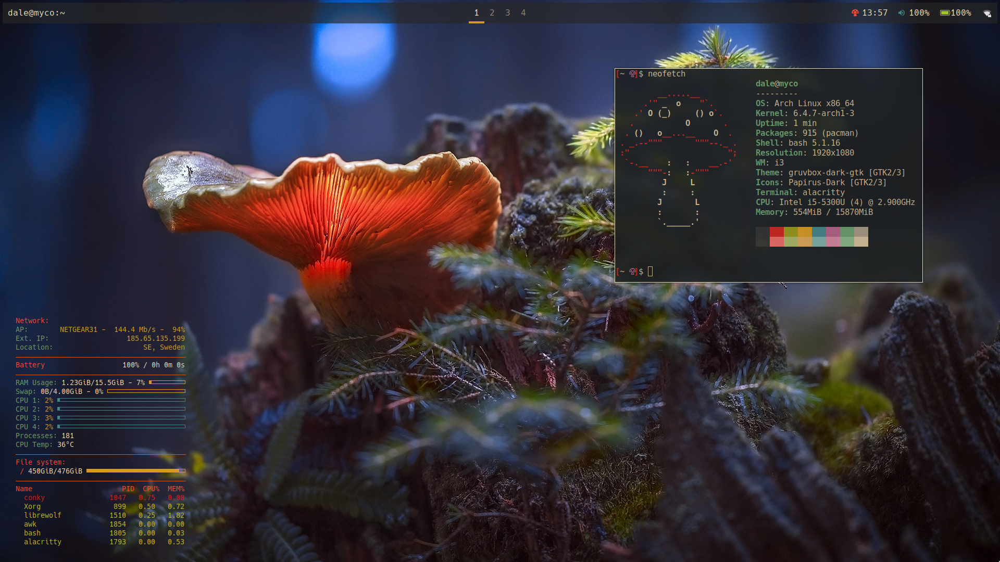
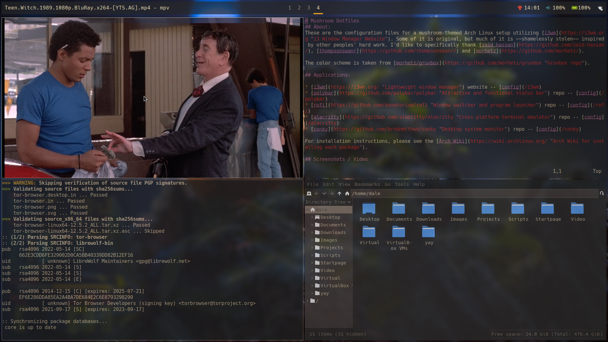

# Mushroom Dotfiles
## About:
These are the configuration files for a mushroom-themed Arch Linux setup utilizing [i3wm](https://i3wm.org "i3 Window Manager Website"). Some of it is original, but much of it is ~~shamelessly stolen from~~ inspired by other peoples' hard work. I'd like to specifically thank [zaid hassan](https://github.com/zaid-hassan/), [thompsonseanr](https://github.com/thompsonseanr/) and [morhetz](https://github.com/morhetz/).

The color scheme is taken from [morhetz/gruvbox](https://github.com/morhetz/gruvbox "Gruvbox repo"). The [wallpaper](i3/mush-wallpaper.jpg "Wallpaper used in this theme") is courtesy of [xGhostx](https://wall.alphacoders.com/profile.php?id=54003).

## Applications:

* [i3wm](https://i3wm.org/ "Lightweight window manager") website -- [config](/i3)
* [polybar](https://github.com/polybar/polybar "Attractive and functional status bar") repo -- [config](/polybar)
* [rofi](https://github.com/davatorium/rofi "Window switcher and program launcher") repo -- [config](/rofi)
* [alacritty](https://github.com/alacritty/alacritty "Cross platform terminal emulator") repo -- [config](/alacritty)
* [conky](https://github.com/brndnmtthws/conky "Desktop system monitor") repo -- [config](/conky) *

For installation instructions, please see the [Arch Wiki](https://wiki.archlinux.org/ "Arch Wiki for installing each package").

\* conky.conf uses a shell script that requires [geoip](https://archlinux.org/packages/extra/x86_64/geoip/ "Application that returns the country of a given IP address"), which can be installed with `sudo pacman -S geoip geoip-database`

## Screenshots / Video

