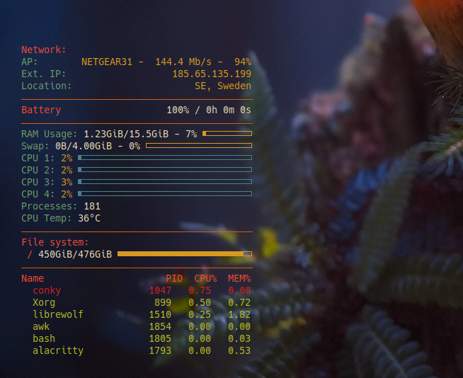

# Conky Configuration

This [conky.conf](conky.conf) is a slightly modified version of [thompsonseanr](https://github.com/thompsonseanr/)'s [Gruvbox-Conky-Config](https://github.com/thompsonseanr/Gruvbox-Conky-Config).

I bounce between a lof of VPN's and like to know at a glance where in the world I'm connected to. This might not be the most efficient method for capturing that data, but I wrote a short bash script ([exiploc.sh](exiploc.sh)) that curls [icanhazip.com](https://icanhazip.com/ "Free service that just returns your IP address") and runs [geoiplookup](https://archlinux.org/packages/extra/x86_64/geoip/ "Arch package page for geoip") to return your external IP's country. It writes these to a file (exiploc.txt) which conky then reads from. I used a systemd timer to run this every ~15 seconds and included the .service and .timer files. Instructions for enabling new systemd timers are available [here on the Arch Wiki](https://wiki.archlinux.org/title/Systemd/Timers "Arch Wiki page for systemd timers").

Alternatively, you could also use [cron](https://wiki.archlinux.org/title/Cron "Arch Wiki page for cron") or another scheduling tool.

In order for this to work, you need to install geoip and the country database:

`sudo pacman -S geoip geoip-database`

## Screenshot

